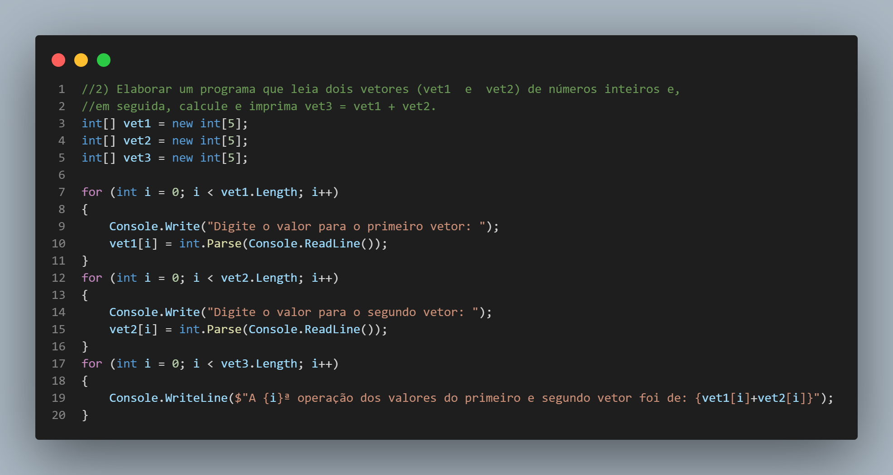

# Estudo de Vetores em C#
> Estudo de vetores e resolução de exercicios com vetor.
---
#### Revertendo
>Neste exercicio os numeros são inseridos e exibidos de forma contraria posteriormente, com o uso de um _for_ para obter os valores e o uso de outro _for_ com decremento para reverter a ordem de exibição

---

#### Média aritimética
> Neste exercicio o programa recebe valores reais e o armazenam em um vetor com o uso de um _for_, e após isso realizo duas operações para obter o total e então a média, com um _IF_ dentro do _for_ consigo obter e exibir quais são os valores acima da média.

---

#### Soma
> Aqui realizo a leitura de numeros reais através de dois vetores com um _for_ e os armazeno. Posteriormente com outro _for_ exibo com um terceiro vetor o resultado da soma entre os valores informados.

---

#### Multiplicação e Subtração
> Já aqui utilizo tambem o uso de 3 vetores, 2 para armazenar os valores e um terceiro para exibir o resultado de uma operação, porem desta vez com o acrescimo de multiplicação e subtração no processamento.

---

#### Divisão
> Neste ultimo exercicio assim como os anteriores utilizo 3 vetores tambem, porem como se trata de uma operação de divisão o programa poderia crashar caso o usuario digitasse um 0(zero), pois não é possivel ter um zero como divisor em uma operação de divisão, então com isso faço o uso de um _while_ para tratar um possivel erro na entrada dos dados e solicito para que o usuario preencha a operação com um valor que possa ser calculado.

---
## Contato 

Gustavo Moreno - [Linkedin](https://www.linkedin.com/in/gustavo-moreno-5803a0229)

Meu e-mail: gustavomorenosiqueira86@gmail.com

Celular: (11) 99786-8798
